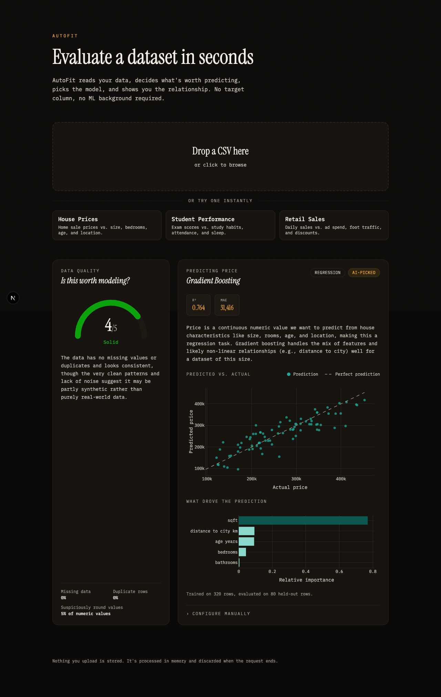

# AutoFit

[Live Demo](https://auto-fit-pi.vercel.app/)

AutoFit turns a raw CSV into a fitted predictive model and a data quality rating, with no ML knowledge required. Upload a dataset and it picks the target variable, the predictors, the model, and the evaluation metrics for you.

## The problem

Most tools that turn a raw dataset into predictive charts still assume you think like a data scientist: you have to already know which column you're predicting, which columns explain it, and which model architecture to reach for before the tool does anything useful. The gap between "I have a dataset" and "I can see the relationships in it" is exactly the friction most people get stuck on.

AutoFit removes that prerequisite. Upload a CSV and it decides what's worth predicting, what predicts it, and which model fits, with no target column, no model selection, and no configuration.

## Features

- **Zero-configuration modeling.** Claude reads a column-level statistical profile of the dataset (never the raw data itself) and reasons through the same decisions a data scientist would make by hand: which column to predict, which columns are useful predictors, whether it's a regression or classification problem, which model fits, and which evaluation metrics actually matter for that target — not just a hardcoded default.
- **Data quality scoring, not just a prediction.** A 1–5 rating flags completeness issues and the likelihood a dataset is synthetic or AI-generated, so you know whether the result underneath is worth trusting before you act on it.
- **Manual override with instant re-fit.** Every AI pick — target, features, model, task type, metrics — can be second-guessed and re-run. The re-run never calls the LLM again: it's a pure, deterministic scikit-learn re-fit, so it's instant, free, and doesn't depend on an API being up. The AI's job is to produce the first recommendation; everything after that is the user's own call.
- **Interactive, purpose-built visualizations.** Actual-vs-predicted fit, feature importance, and class distributions rendered client-side, designed around the dataset's shape rather than dropped into generic default chart styling.
- **Production guardrails, not an afterthought.** File size and row-count caps, zero data persistence (everything is processed in memory and discarded once the request ends), and per-IP rate limiting protecting the LLM spend on a public-facing link.

## Tech stack

**Frontend** — Next.js (App Router, TypeScript), Tailwind CSS, Plotly.js.

**Backend** — Flask (Python), pandas for dataset profiling, scikit-learn for model fitting, the Anthropic API (Claude) for reasoning, Flask-Limiter for rate limiting, gunicorn for production serving.

**Deployment** — Frontend on Vercel, Backend on Render